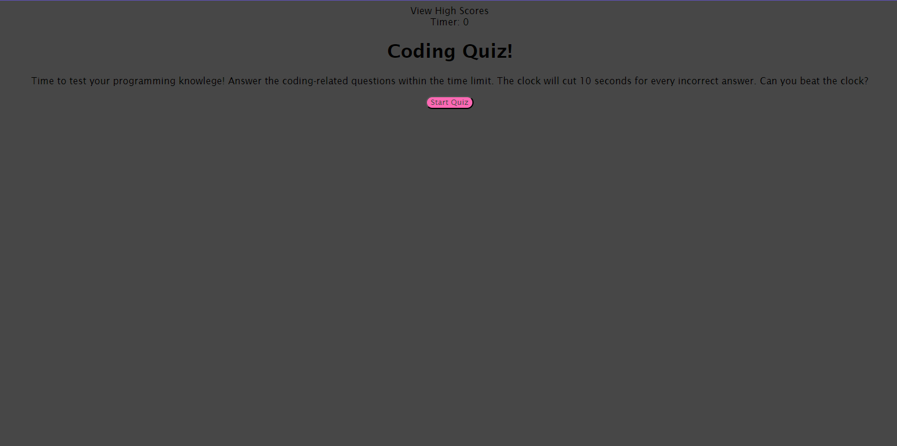

# Coding-Quiz

   

  This project is a quiz to test the knowlege of a new programmer, Can be used to test newcomers to the programming scene

  ## Table of Contents
  1. [Installation](#installation)
  2. [usage](#usageinfo)
  3. [license](#licenses)
  4. [Contributors](#contribution)
  5. [Tests](#testing)

  ## Installation
  N/A

  ## Usage
 

  ## License
  MIT

  ## Contributors
  N/A

  ## Tests
  N/A
